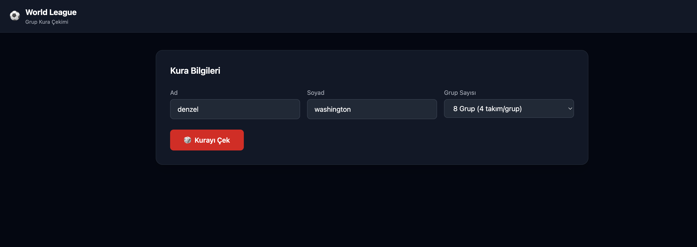
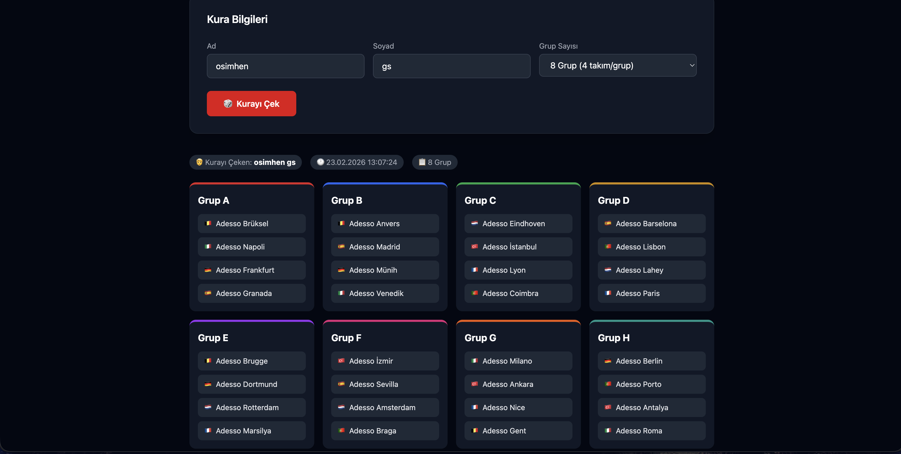

<div align="center">


# ⚽ Adesso World League


## Screenshots

<table>
<tr>
<td align="center"><b>Kura UI</b></td>
<td align="center"><b>Kura Sonucu</b></td>
</tr>
<tr>
<td></td>
<td></td>
</tr>
</table>

</div>

---

<table>
<tr>
<th width="50%">🇬🇧 English</th>
<th width="50%">🇹🇷 Türkçe</th>
</tr>
<tr>
<td valign="top">

## Overview

A **.NET 10 Web API** that performs a randomized group draw for the **Adesso World League** — 32 teams from 8 countries distributed across groups with full constraint enforcement (no two teams from the same country in the same group).

Includes a lightweight **draw UI** served directly from the API — no separate frontend project needed.

## Features

-  **Draw UI** — simple web interface, no extra setup
-  **Randomized draw** — round-robin with live country constraint checks
-  **PostgreSQL persistence** — every draw saved with drawer info
-  **Dual API docs** — Scalar (DeepSpace) + Swagger UI
-  **Localization** — error messages in TR (default) and EN
-  **Configurable groups** — `n = 4` (8 teams/group) or `n = 8` (4 teams/group)

## Quick Start

```bash
# 1. Update connection string
# src/.../appsettings.json → DefaultConnection

# 2. Run (migrations + seeding apply automatically)
cd src/AdessoWorldLeague.API
dotnet run
```

| | URL |
|---|---|
|  **Draw UI** | `http://localhost:5116` |
|  **Scalar** | `http://localhost:5116/scalar` |
|  **Swagger** | `http://localhost:5116/swagger` |

## API

```http
POST /api/draw
Content-Type: application/json

{
  "groupCount": 8,
  "drawerFirstName": "Ahmet",
  "drawerLastName": "Yılmaz"
}
```

## Countries

| # | Country | Teams |
|---|---|---|
| 1 | 🇹🇷 Türkiye | İstanbul, Ankara, İzmir, Antalya |
| 2 | 🇩🇪 Almanya | Berlin, Frankfurt, Münih, Dortmund |
| 3 | 🇫🇷 Fransa | Paris, Marsilya, Nice, Lyon |
| 4 | 🇳🇱 Hollanda | Amsterdam, Rotterdam, Lahey, Eindhoven |
| 5 | 🇵🇹 Portekiz | Lisbon, Porto, Braga, Coimbra |
| 6 | 🇮🇹 İtalya | Roma, Milano, Venedik, Napoli |
| 7 | 🇪🇸 İspanya | Sevilla, Madrid, Barselona, Granada |
| 8 | 🇧🇪 Belçika | Brüksel, Brugge, Gent, Anvers |

## Tech Stack

- **ASP.NET Core 10** — Web API (controller-based)
- **EF Core 10 + Npgsql** — PostgreSQL ORM
- **Static HTML + Tailwind CDN** — Draw UI (wwwroot)
- **Scalar** — Modern API explorer
- **Swashbuckle** — Swagger UI
- **IStringLocalizer** — TR/EN localization

</td>
<td valign="top">

## Genel Bakış

**Adesso World League** için rastgele grup çekilişi yapan bir **.NET 10 Web API**'si — 8 ülkeden 32 takımı gruplara tam kısıt uygulamasıyla dağıtır (aynı grupta aynı ülkeden iki takım olamaz).

Ayrı bir frontend projesine gerek kalmadan doğrudan API'den sunulan hafif bir **kura UI**'ı içerir.

## Özellikler

-  **Kura UI** — basit web arayüzü, ek kurulum gerektirmez
-  **Rastgele kura** — anlık ülke kısıt kontrolüyle round-robin slot dolumu
-  **PostgreSQL kalıcılığı** — her kura kurayı çekenin bilgisiyle kaydedilir
-  **Çift API dökümanı** — Scalar (DeepSpace) + Swagger UI
-  **Lokalizasyon** — hata mesajları TR (varsayılan) ve EN
-  **Yapılandırılabilir grup** — `n = 4` (grup başına 8 takım) veya `n = 8` (grup başına 4 takım)

## Hızlı Başlangıç

```bash
# 1. Connection string'i güncelle
# src/.../appsettings.json → DefaultConnection

# 2. Çalıştır (migration + seed otomatik uygulanır)
cd src/AdessoWorldLeague.API
dotnet run
```

| | URL |
|---|---|
|  **Kura UI** | `http://localhost:5116` |
|  **Scalar** | `http://localhost:5116/scalar` |
|  **Swagger** | `http://localhost:5116/swagger` |

## API

```http
POST /api/draw
Content-Type: application/json

{
  "groupCount": 8,
  "drawerFirstName": "Ahmet",
  "drawerLastName": "Yılmaz"
}
```

## Ülkeler

| # | Ülke | Takımlar |
|---|---|---|
| 1 | 🇹🇷 Türkiye | İstanbul, Ankara, İzmir, Antalya |
| 2 | 🇩🇪 Almanya | Berlin, Frankfurt, Münih, Dortmund |
| 3 | 🇫🇷 Fransa | Paris, Marsilya, Nice, Lyon |
| 4 | 🇳🇱 Hollanda | Amsterdam, Rotterdam, Lahey, Eindhoven |
| 5 | 🇵🇹 Portekiz | Lisbon, Porto, Braga, Coimbra |
| 6 | 🇮🇹 İtalya | Roma, Milano, Venedik, Napoli |
| 7 | 🇪🇸 İspanya | Sevilla, Madrid, Barselona, Granada |
| 8 | 🇧🇪 Belçika | Brüksel, Brugge, Gent, Anvers |

## Teknoloji

- **ASP.NET Core 10** — Web API (controller tabanlı)
- **EF Core 10 + Npgsql** — PostgreSQL ORM
- **Static HTML + Tailwind CDN** — Kura UI (wwwroot)
- **Scalar** — Modern API explorer
- **Swashbuckle** — Swagger UI
- **IStringLocalizer** — TR/EN lokalizasyon

</td>
</tr>
</table>


<table>
<tr>
<th width="50%"> Architecture</th>
<th width="50%"> Mimari</th>
</tr>
<tr>
<td valign="top">

```
Browser (UI)
    ↓  fetch POST /api/draw
GlobalExceptionHandler
    ↓
DrawController  (no try-catch)
    ↓
DrawService  (draw algorithm + validation)
    ↙        ↘
AppDbContext  ITeamDataProvider
    ↓
PostgreSQL
```

**Design Patterns:** Service, DTO, Repository (via EF), Dependency Inversion, Strategy

</td>
<td valign="top">

```
Tarayıcı (UI)
    ↓  fetch POST /api/draw
GlobalExceptionHandler
    ↓
DrawController  (try-catch yok)
    ↓
DrawService  (kura algoritması + validasyon)
    ↙        ↘
AppDbContext  ITeamDataProvider
    ↓
PostgreSQL
```

**Tasarım Desenleri:** Service, DTO, Repository (EF üzerinden), Dependency Inversion, Strategy

</td>
</tr>
</table>

---

<div align="center">

📄 [`docs/documentation-en.md`](docs/documentation-en.md) · [`docs/documentation-tr.md`](docs/documentation-tr.md) · [`docs/testing.md`](docs/testing.md)

Made with ❤️ for Adesso Code Challenge

</div>
